# Introduction

Sports around the World is a project for the University Lesson Tecnologias Internet and it focuses on the Cultural Aspect of Sports. In this Work Report I will analyze what steps I took and go into some form of details regarding the whole Project.

This Project is made by Ioannis Krokidis, A046174, Group 11

# User Interface / Decisions / Data Gathering

I always use Figma for Designing new Projects. I create the wireframes there and then I apply it into code. After I apply it into code I see what needs to be changed and re-do the same step with Figma.

I will demonstrate the Original Figma Design Page by Page and then Compare it into the Final Result.

Before Starting a project a lot of information should be gathered around that. What is the scope of the project? How can it be categorized and then how will you connect the style into the Project.

I will start by explaining this and then we can dive into the designs.

## Starting Decisions for the Project

The project didnt't need to be very big, it's just a concept of learning how to code and applying it into interesting topics. So looking at that I created interesting pages that are small but sweet.

So the first step is imagining these pages, the second step is to expand them and understand what would be interesting to put into the website, the third step is to gather data and the fourth step is to create the design's backbone.

### Imagining the Website

The first one ( **Home Page** ) which showcases the Countries and their respecting Sports. ( **Sports Page** ) to show lots of details regarding that Sport and its countries and how it affects the world. ( **Cultural Impact of Sports**) to show how the overall daily culture gets affected regarding sports and ( **Sports Turism** ) that shows the essence and backbone of all sports ( stadiums, museums ).

### Getting ideas about what to put into each page

So after getting a little glimpse of imagining the website, we can expand it with thinking the information that would look amazing there.

For this step I have included in the whole zip a file called "Work Notes.txt" which is this step exactly.

### Getting Data

So after getting the ideas, now getting data is the hard part. For this tool I used mostly ChatGPT, Wikipedia, Youtube Videos and a lot of articles that I lost count and forgot to mention. I will be mentioning however the code part that I have "loaned"...

### Creating the Design's BackBone

Design's Backbone in my way means choosing what colors to represent the website, typography, type scale, font. I won't get in lots of details in this one but in essence I picked Green color to represent the grass of fields, the blue is a complimentary and secondary color which breaks the monotony of the green color. As far for typography I picked a relaxing / informational and interesting font.

Here's a detailed look into the BackBone:

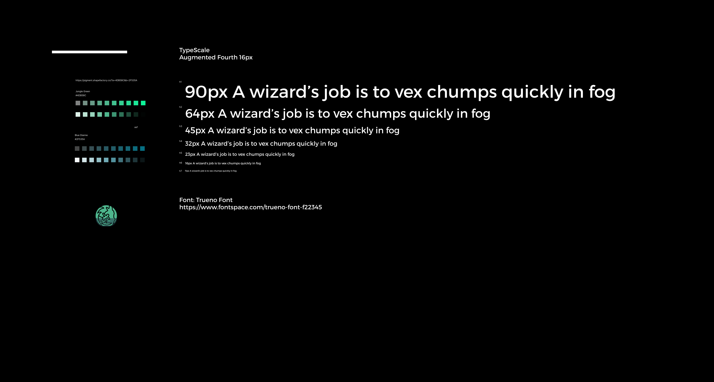

## Mapping the Design to the Final Result

In this section I will map all of the designs with their respecting final result. This is to show how the Design choices affect the final result and also to show that with code it's way easier to set the measurements instead of Design

Each next subsection will focus on each different WebPage. Left Part is the Design and Right Part is the Final Work.

### Home ( Introduction )

|                             Globe Not Selected Country Design                             |                                                 Globe Not Selected Country Final                                                  |
| :---------------------------------------------------------------------------------------: | :-------------------------------------------------------------------------------------------------------------------------------: |
| [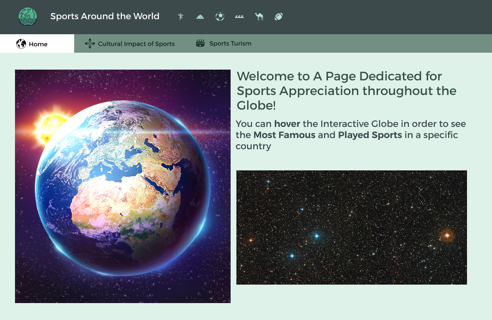](./Images/Home_Globe_Design.png) | [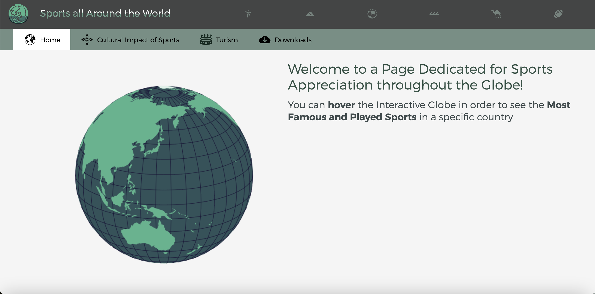](./Images/Home_Globe_Not_Selected_Country_Final.png) |

|                                                    Globe Selected Country Design                                                    |                              Globe Selected Country Final                               |
| :---------------------------------------------------------------------------------------------------------------------------------: | :-------------------------------------------------------------------------------------: |
| [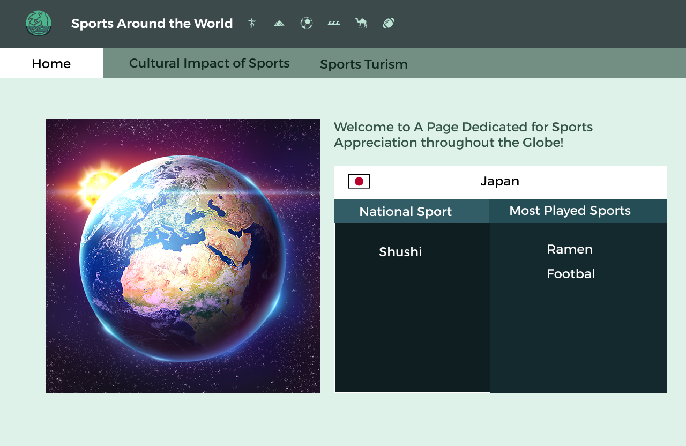](./Images/Home_Globe_Not_Selected_Country_Design.png) |  |

|                                         Infomation Design                                         |                                        Information Final                                        |
| :-----------------------------------------------------------------------------------------------: | :---------------------------------------------------------------------------------------------: |
| [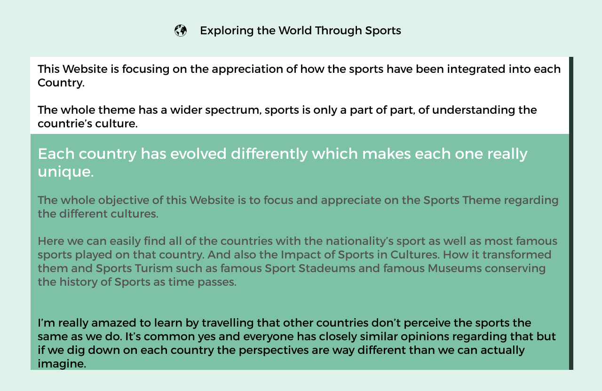](./Images/Home_Exploring_Design.png) |  |

|                                   Countries Not Selected Design                                   |                                  Countries Not Selected Final                                   |
| :-----------------------------------------------------------------------------------------------: | :---------------------------------------------------------------------------------------------: |
| [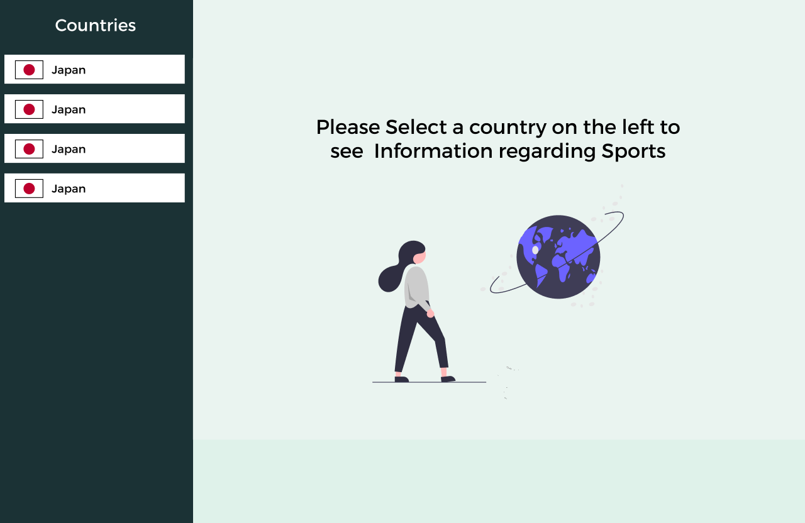](./Images/Home_Countries_Design.png) |  |

|                                    Country Selected Design                                    |                                   Country Selected Final                                    |
| :-------------------------------------------------------------------------------------------: | :-----------------------------------------------------------------------------------------: |
| [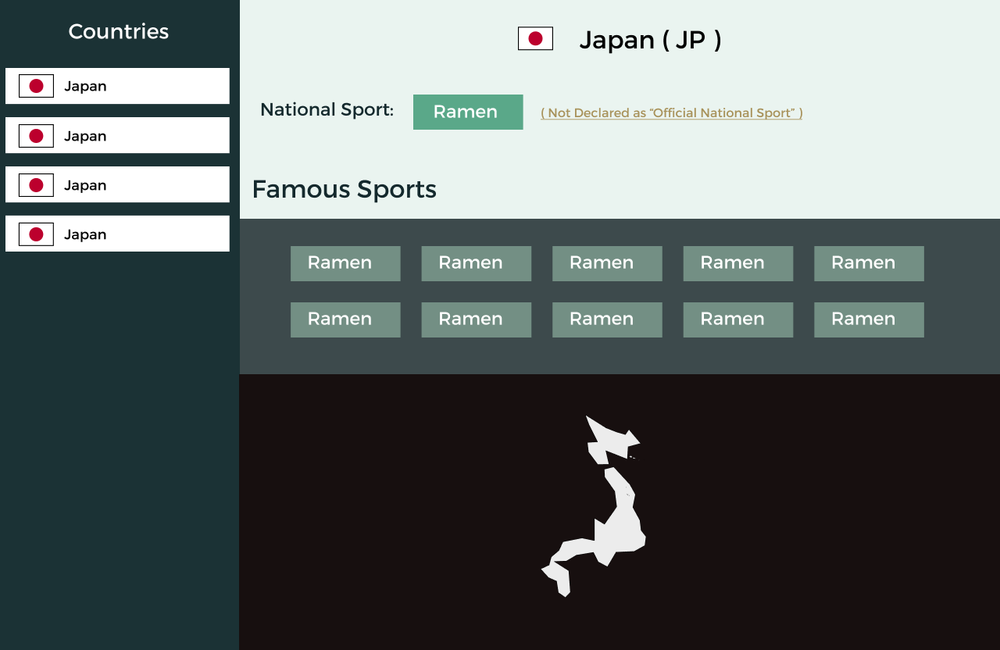](./Images/Home_Country_Design.png) |  |

### Specific Sport

Final Result has cropped top header and bottom for quality

|                              Specific Sport Design                              |                             Specific Sport Final                              |
| :-----------------------------------------------------------------------------: | :---------------------------------------------------------------------------: |
| [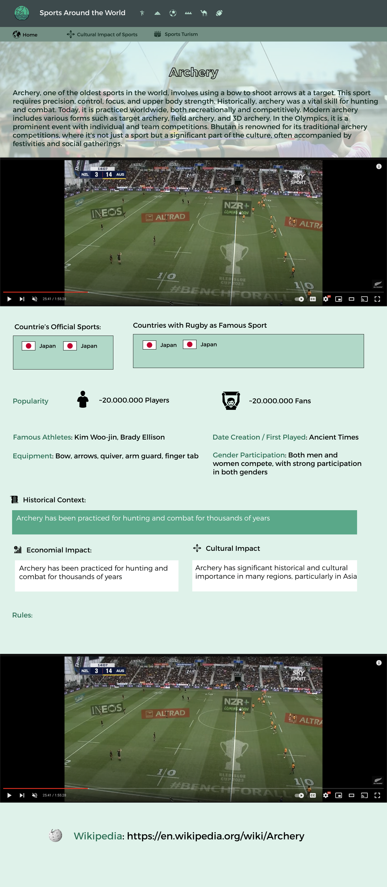](./Images/Sport_Design.png) | [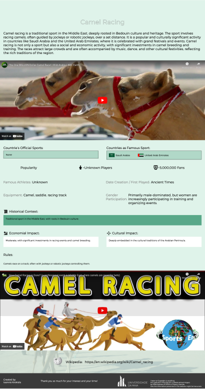](./Images/Sport_Final.png) |

### Cultural Impact of Sports

Final Result has cropped top header and bottom for quality

|                           Cultural Impact of Sports Design                            |                           Cultural Impact of Sports Final                           |
| :-----------------------------------------------------------------------------------: | :---------------------------------------------------------------------------------: |
| [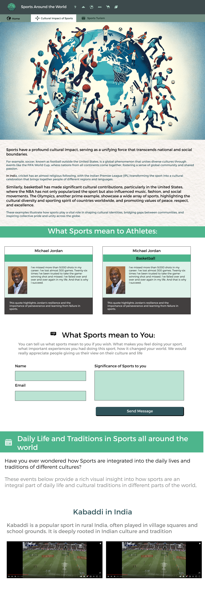](./Images/Cultural_Design.png) | [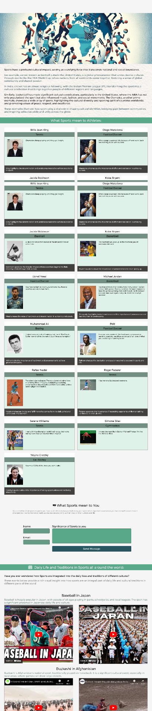](./Images/Cultural_Final.png) |

### Turism

Final Result has cropped top header and bottom for quality

|                                   Turism Design                                   |                                  Turism Final                                   |
| :-------------------------------------------------------------------------------: | :-----------------------------------------------------------------------------: |
|  | [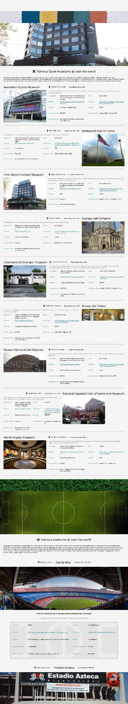](./Images/Turism_Final.png) |

### Download

Final Result has cropped top header and bottom for quality

Download wasn't designed, it was automatically created in code

|                                   Download Design                                   |                                   Download Final                                    |
| :---------------------------------------------------------------------------------: | :---------------------------------------------------------------------------------: |
| [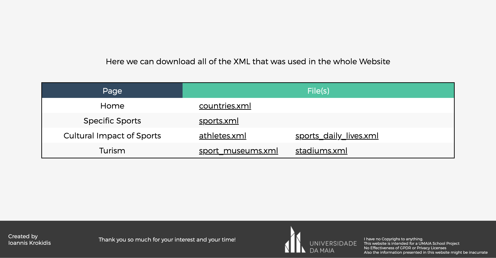](./Images/Download_Final.png) |  |

# Product

Around the area Sports, this Project’s focus is how all cultures around the world use it.
It’s fascinating how each culture has evolved throughout the years and Sports is one part of it.
A sport which we play with some rules can be different in another country and also the significance of it.

## Netlift Link

Netlify link: [inf23tig11](https://inf23tig11.netlify.app/)

If it doesn't load please refresh the page.

## Installation and configuration instructions

The website is static, so any live web server can be used or just opened through the browser as a file. Everything will work the same but internet connection is required to load specific data.

For Netlify, I pushed the project into a Github Repository and then deployed very easily using the freely netlify account.

## Usage Rules

Authentication is not required for the project, limitations can be that I load a lot of information so the computer might respond slowly

## Navigation Aid

I have included buttons and also transitions / cursor that can be clicked to show navigation aid. And in the form of the menu it is clearly defined as a "White" page the current page.

## Form Validations

No Form Validation has been implemented

## HTML and CSS validation

No HTML or CSS Validation has been made

## Implementation Details

All of the implementation details defined in the document are present in my project but the ones that I have missed are:

- responsiveness to at least two screen dimensions (media queries).
- dynamically import html,css from XML. I only use XML as a database

### Structure of the Source Code

Each document is respectively created in each folder. All of CSS files are in the CSS Folder and so on.

### Libraries Used

For manipulating the DOM I used jQuery. I also used a method to import the XML's and then I assign them into global variables that can be used throughout the project.

I also used d3.js to create the 3d interactive map

Unsplash API to get random images based on sports.

### Extra Features implemented

These are features that didn't really mean a lot to create but when I create something I get tons of creative ideas and then I get caught in loops creating really cool animations/features. Some of them are:

3D Interactive Globe in Home Page, In the logo the Sports All Around the world I animated a wave in the text, I put the countrie's whole structure as SVG when you click the country

In Sports Page, I change the background to fixed depending on the sport. The image is random based on Unsplash.

### Source Code Contribution

All of the code is mine except the libraries that I used and also some functions that I got from StackOverflow, ChatGPT, Youtube, CodePen or some website explaining how to do a specific feature. Ex. downloading XML.

Some contributions which are noted are:
Illustrations:
[Undraw](https://undraw.co/search)

Icons:
[The Noun Project](https://thenounproject.com/)

Images:
[Unsplash](https://unsplash.com/)

Font:
[Trueno](https://www.fontspace.com/trueno-font-f22345)

Wavy Text in logo:
[Wavy Text Tutorial Youtube](https://www.youtube.com/watch?v=Tf6qm5JMUXQ&ab_channel=OnlineTutorials)

Interactive 3d Globe:
[3d Globe Code CodePen](https://codepen.io/annajimenez146/pen/aQxLjy)

How to convert XML to JSON:
[XML to JSON](https://www.geeksforgeeks.org/how-to-convert-xml-to-json-in-javascript/)

And the libraries jQuery, unsplash API, d3.js
